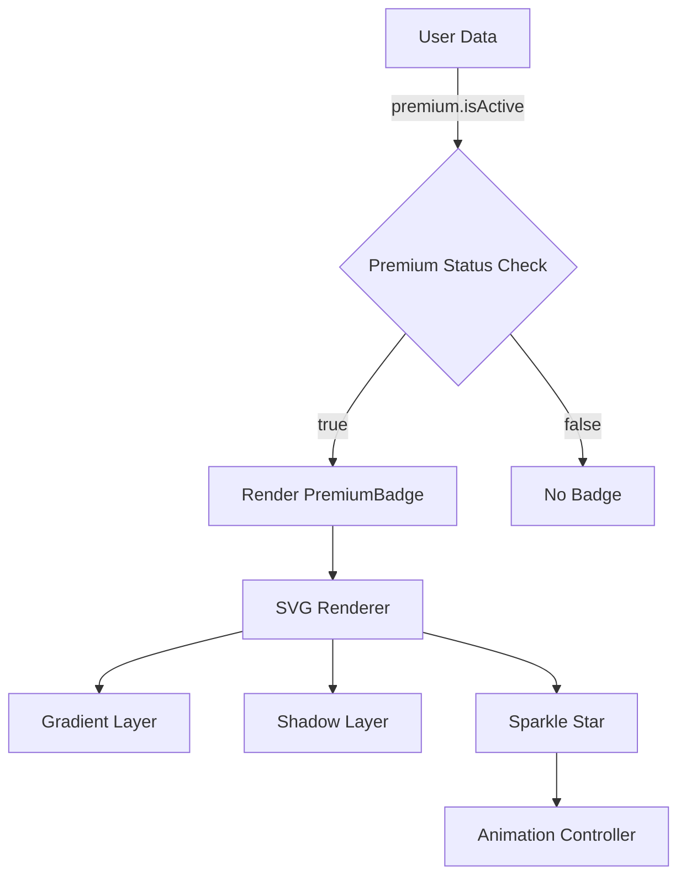

# Design Document: Premium Badge Redesign

## Overview

Ce document présente le design technique pour remplacer le badge premium actuel (étoile jaune simple via Ionicons) par un badge premium unique et visuellement distinctif. Le nouveau badge sera implémenté comme un composant React Native réutilisable utilisant SVG pour garantir une qualité visuelle optimale à toutes les tailles.

### Objectifs du Design

1. Créer un composant `PremiumBadge` réutilisable et performant
2. Implémenter un design moderne avec forme organique, gradient violet/mauve, effet 3D et étoile scintillante
3. Remplacer tous les usages existants du badge premium (Ionicons star) dans l'application
4. Assurer la compatibilité avec les thèmes clair et sombre
5. Maintenir des performances optimales dans les listes scrollables

### Contexte Technique

- **Frontend**: React Native avec Expo
- **Bibliothèque SVG**: `react-native-svg` (déjà disponible via Expo)
- **Animation**: `react-native-reanimated` (déjà utilisé dans le projet)
- **Emplacements actuels du badge**:
  - `Frontend/app/(tabs)/profile.tsx`: Section Premium Subscription
  - `Frontend/app/(tabs)/gallery.tsx`: À côté du nom d'utilisateur dans les items de galerie
  - `Frontend/app/(profile)/user-profile.tsx`: Profil public des utilisateurs premium
  - Cartes d'activités (Activity Cards): Overlay pour les créateurs premium

## Architecture

### Structure des Composants

```
Frontend/
├── components/
│   └── ui/
│       └── PremiumBadge.tsx          # Nouveau composant principal
├── app/
│   ├── (tabs)/
│   │   ├── profile.tsx               # Mise à jour: remplacer Ionicons star
│   │   └── gallery.tsx               # Mise à jour: remplacer Ionicons star
│   └── (profile)/
│       └── user-profile.tsx          # Mise à jour: ajouter badge au profil
```

### Flux de Données



### Décisions d'Architecture

1. **Composant Unique Réutilisable**: Un seul composant `PremiumBadge` avec props pour la taille et le style, plutôt que plusieurs variantes
2. **SVG Natif**: Utilisation de `react-native-svg` pour garantir la qualité vectorielle et éviter les assets bitmap
3. **Animation Optionnelle**: Animation de scintillement activée par défaut mais désactivable pour l'accessibilité
4. **Memoization**: Utilisation de `React.memo` pour optimiser les performances dans les listes

## Components and Interfaces

### PremiumBadge Component

```typescript
// Frontend/components/ui/PremiumBadge.tsx

import React, { useEffect } from 'react';
import { View, StyleSheet } from 'react-native';
import Svg, { Defs, LinearGradient, Stop, Path, Polygon } from 'react-native-svg';
import Animated, {
  useSharedValue,
  useAnimatedProps,
  withRepeat,
  withSequence,
  withTiming,
  Easing,
} from 'react-native-reanimated';

export type PremiumBadgeSize = 'small' | 'medium' | 'large';

export interface PremiumBadgeProps {
  /**
   * Taille du badge
   * - small: 16px (pour gallery items)
   * - medium: 24px (pour profils)
   * - large: 48px (pour affichages spéciaux)
   */
  size?: PremiumBadgeSize;
  
  /**
   * Désactiver l'animation de scintillement
   * Utile pour l'accessibilité ou les performances
   */
  disableAnimation?: boolean;
  
  /**
   * Style personnalisé pour le conteneur
   */
  style?: any;
  
  /**
   * Label d'accessibilité
   */
  accessibilityLabel?: string;
}

/**
 * Dimensions du badge selon la taille
 */
const SIZE_MAP: Record<PremiumBadgeSize, number> = {
  small: 16,
  medium: 24,
  large: 48,
};

/**
 * Badge premium avec forme organique, gradient violet/mauve,
 * effet 3D et étoile scintillante
 */
export const PremiumBadge: React.FC<PremiumBadgeProps> = React.memo(({
  size = 'medium',
  disableAnimation = false,
  style,
  accessibilityLabel = 'Badge Premium',
}) => {
  const dimensions = SIZE_MAP[size];
  const sparkleOpacity = useSharedValue(1);

  useEffect(() => {
    if (!disableAnimation) {
      // Animation de scintillement: fade in/out continu
      sparkleOpacity.value = withRepeat(
        withSequence(
          withTiming(0.3, { duration: 1000, easing: Easing.inOut(Easing.ease) }),
          withTiming(1, { duration: 1000, easing: Easing.inOut(Easing.ease) })
        ),
        -1, // Répétition infinie
        false
      );
    }
  }, [disableAnimation]);

  const animatedSparkleProps = useAnimatedProps(() => ({
    opacity: sparkleOpacity.value,
  }));

  return (
    <View
      style={[styles.container, style]}
      accessible={true}
      accessibilityLabel={accessibilityLabel}
      accessibilityRole="image"
    >
      <Svg
        width={dimensions}
        height={dimensions}
        viewBox="0 0 24 24"
      >
        <Defs>
          {/* Gradient violet/mauve */}
          <LinearGradient id="premiumGradient" x1="0%" y1="0%" x2="100%" y2="100%">
            <Stop offset="0%" stopColor="#8B5CF6" stopOpacity="1" />
            <Stop offset="100%" stopColor="#A78BFA" stopOpacity="1" />
          </LinearGradient>
        </Defs>

        {/* Forme organique (blob) avec gradient */}
        <Path
          d="M12 2C12 2 8 3 6 6C4 9 3 12 4 15C5 18 7 20 10 21C13 22 16 21 18 19C20 17 22 14 21 11C20 8 17 4 14 3C13 2.5 12 2 12 2Z"
          fill="url(#premiumGradient)"
          opacity="0.95"
        />

        {/* Ombre pour effet 3D (légèrement décalée) */}
        <Path
          d="M12 2C12 2 8 3 6 6C4 9 3 12 4 15C5 18 7 20 10 21C13 22 16 21 18 19C20 17 22 14 21 11C20 8 17 4 14 3C13 2.5 12 2 12 2Z"
          fill="#000000"
          opacity="0.15"
          transform="translate(0.5, 0.5)"
        />

        {/* Étoile scintillante dorée (top-right) */}
        <AnimatedPolygon
          points="18,4 18.5,5.5 20,6 18.5,6.5 18,8 17.5,6.5 16,6 17.5,5.5"
          fill="#FBBF24"
          animatedProps={disableAnimation ? undefined : animatedSparkleProps}
        />
      </Svg>
    </View>
  );
});

const AnimatedPolygon = Animated.createAnimatedComponent(Polygon);

const styles = StyleSheet.create({
  container: {
    justifyContent: 'center',
    alignItems: 'center',
  },
});
```

### Badge Renderer Service

Le rendu du badge est géré directement par le composant `PremiumBadge` via `react-native-svg`. Aucun service séparé n'est nécessaire car la logique de rendu est encapsulée dans le composant.

### Integration Points

#### 1. Profile Screen (`profile.tsx`)

```typescript
// Avant (ligne ~138):
<Pressable style={styles.menuItem} onPress={...}>
  <IconSymbol
    name="crown.fill"
    size={22}
    color={user?.premium?.isActive ? Colors.gold : Colors.primary}
  />
  <Text style={[styles.menuText, { color: colors.text }]}>
    {user?.premium?.isActive ? "Mon abonnement Premium" : "Passer à Premium"}
  </Text>
  {user?.premium?.isActive && (
    <View style={styles.premiumBadge}>
      <Text style={styles.premiumBadgeText}>Premium</Text>
    </View>
  )}
  ...
</Pressable>

// Après:
import { PremiumBadge } from "@/components/ui/PremiumBadge";

<Pressable style={styles.menuItem} onPress={...}>
  <IconSymbol
    name="crown.fill"
    size={22}
    color={user?.premium?.isActive ? Colors.gold : Colors.primary}
  />
  <Text style={[styles.menuText, { color: colors.text }]}>
    {user?.premium?.isActive ? "Mon abonnement Premium" : "Passer à Premium"}
  </Text>
  {user?.premium?.isActive && (
    <PremiumBadge size="small" style={{ marginLeft: 'auto', marginRight: 8 }} />
  )}
  ...
</Pressable>
```

#### 2. Gallery Screen (`gallery.tsx`)

```typescript
// Avant (ligne ~165):
<View style={styles.userInfo}>
  <Text style={[styles.userName, { color: colors.text }]}>
    {item.userId.name}
  </Text>
  {item.userId.premium?.isActive && (
    <Ionicons
      name="star"
      size={12}
      color={Colors.gold}
      style={styles.premiumBadge}
    />
  )}
</View>

// Après:
import { PremiumBadge } from "@/components/ui/PremiumBadge";

<View style={styles.userInfo}>
  <Text style={[styles.userName, { color: colors.text }]}>
    {item.userId.name}
  </Text>
  {item.userId.premium?.isActive && (
    <PremiumBadge size="small" />
  )}
</View>
```

#### 3. User Profile Screen (`user-profile.tsx`)

```typescript
// Ajouter après le nom du profil (ligne ~200):
<View style={styles.profileInfo}>
  <View style={{ flexDirection: 'row', alignItems: 'center', gap: 6 }}>
    <Text style={[styles.profileName, { color: colors.text }]}>
      {profile.user.name}
    </Text>
    {profile.user.premium?.isActive && (
      <PremiumBadge size="small" />
    )}
  </View>
  <Text style={[styles.profileTime, { color: colors.textSecondary }]}>
    Membre depuis {memberSince}
  </Text>
</View>
```

## Data Models

### Type Definitions

```typescript
// Types existants utilisés (pas de modification nécessaire)

interface User {
  _id: string;
  name: string;
  email: string;
  avatar?: string;
  premium?: {
    isActive: boolean;
    subscriptionId?: string;
    expiresAt?: Date;
  };
  // ... autres champs
}

interface GalleryFeedItem {
  _id: string;
  userId: {
    _id: string;
    name: string;
    avatar?: string;
    premium?: {
      isActive: boolean;
    };
  };
  photos: Photo[];
  // ... autres champs
}
```

### SVG Path Data

Les données de path SVG pour la forme organique du badge:

```typescript
/**
 * Path data pour la forme organique (blob)
 * Coordonnées optimisées pour un viewBox de 24x24
 */
const BLOB_PATH = "M12 2C12 2 8 3 6 6C4 9 3 12 4 15C5 18 7 20 10 21C13 22 16 21 18 19C20 17 22 14 21 11C20 8 17 4 14 3C13 2.5 12 2 12 2Z";

/**
 * Points pour l'étoile scintillante (8 points)
 * Position: top-right du badge
 */
const SPARKLE_POINTS = "18,4 18.5,5.5 20,6 18.5,6.5 18,8 17.5,6.5 16,6 17.5,5.5";
```

## Correctness Properties

*Une propriété est une caractéristique ou un comportement qui devrait être vrai pour toutes les exécutions valides d'un système - essentiellement, une déclaration formelle sur ce que le système devrait faire. Les propriétés servent de pont entre les spécifications lisibles par l'homme et les garanties de correction vérifiables par machine.*


### Property Reflection

Après analyse du prework, j'ai identifié les propriétés suivantes qui nécessitent une consolidation:

**Redondances identifiées:**

1. **Propriétés 3.1, 4.1, 5.1** (Conditional rendering based on premium status): Ces trois propriétés testent essentiellement la même chose - que le badge s'affiche quand premium.isActive est true. Elles peuvent être consolidées en une seule propriété générale sur le rendu conditionnel.

2. **Propriétés 3.5 et 8.1** (No badge when not premium): Ces propriétés sont l'inverse de la propriété ci-dessus et peuvent être combinées.

3. **Propriétés 10.3 et 10.4** (Theme consistency): Ces propriétés testent que certains aspects visuels restent cohérents ou s'adaptent selon le thème. Elles peuvent être combinées en une propriété plus générale sur la compatibilité thématique.

**Propriétés consolidées retenues:**

Après réflexion, voici les propriétés uniques qui apportent une valeur de validation distincte:

1. **Size variant dimensions** (1.3): Vérifie que chaque taille produit les bonnes dimensions
2. **Accessibility label propagation** (1.7): Vérifie que les labels d'accessibilité sont correctement appliqués
3. **Visual quality at all sizes** (2.5): Vérifie que le badge maintient sa qualité à toutes les tailles
4. **Conditional rendering based on premium status** (3.1, 3.5, 4.1, 5.1, 8.1 consolidés): Vérifie le rendu conditionnel
5. **Animation control via prop** (6.4): Vérifie que l'animation peut être désactivée
6. **Screen density scaling** (9.1): Vérifie le scaling proportionnel
7. **Text size adaptation** (9.5): Vérifie l'alignement avec différentes tailles de texte
8. **Theme-based visual adaptation** (10.3, 10.4, 10.5 consolidés): Vérifie la compatibilité thématique

### Property 1: Size Variant Dimensions

*Pour toute* variante de taille (small, medium, large), le composant PremiumBadge doit rendre avec les dimensions exactes spécifiées (16px, 24px, 48px respectivement).

**Validates: Requirements 1.3**

### Property 2: Accessibility Label Propagation

*Pour tout* label d'accessibilité fourni via props, le composant PremiumBadge doit appliquer ce label aux propriétés d'accessibilité du composant.

**Validates: Requirements 1.7**

### Property 3: Visual Quality Preservation Across Sizes

*Pour toute* taille supportée (small, medium, large), le composant PremiumBadge doit maintenir son aspect ratio et la qualité visuelle de tous ses éléments (blob, gradient, sparkle).

**Validates: Requirements 2.5**

### Property 4: Conditional Rendering Based on Premium Status

*Pour tout* objet utilisateur, le badge premium doit être rendu si et seulement si `user.premium.isActive` est `true`. Lorsque cette propriété est `false`, `undefined`, ou que l'objet `premium` n'existe pas, aucun badge ne doit être affiché.

**Validates: Requirements 3.1, 3.5, 4.1, 5.1, 8.1**

### Property 5: Animation Control via Prop

*Pour toute* valeur du prop `disableAnimation` (true ou false), le composant PremiumBadge doit activer ou désactiver l'animation de scintillement en conséquence. Lorsque `disableAnimation` est `true`, aucune animation ne doit être active.

**Validates: Requirements 6.4**

### Property 6: Proportional Scaling Across Screen Densities

*Pour toute* densité d'écran (1x, 2x, 3x), le composant PremiumBadge doit maintenir ses proportions et sa qualité visuelle, avec un scaling proportionnel des dimensions.

**Validates: Requirements 9.1**

### Property 7: Text Size Adaptation

*Pour toute* taille de texte utilisée pour le nom d'utilisateur adjacent, le composant PremiumBadge doit s'aligner correctement verticalement avec le texte, maintenant un alignement centré.

**Validates: Requirements 9.5**

### Property 8: Theme-Based Visual Consistency

*Pour tout* thème (clair ou sombre), le composant PremiumBadge doit:
- Maintenir les couleurs du gradient violet/mauve inchangées
- Assurer la visibilité de l'étoile scintillante dorée
- Ajuster l'opacité de l'ombre en fonction du thème (ombres plus légères en mode sombre)

**Validates: Requirements 10.3, 10.4, 10.5**

## Error Handling

### Component Error Boundaries

Le composant `PremiumBadge` doit gérer gracieusement les erreurs potentielles:

1. **Props invalides**: Si des props invalides sont fournis, le composant doit utiliser des valeurs par défaut sûres
2. **Erreurs de rendu SVG**: Si le rendu SVG échoue, le composant doit échouer silencieusement sans crasher l'application
3. **Erreurs d'animation**: Si l'animation ne peut pas démarrer, le badge doit s'afficher en mode statique

### Fallback Behavior

```typescript
// Exemple de gestion d'erreur dans le composant
try {
  // Rendu du badge SVG
} catch (error) {
  console.warn('PremiumBadge render error:', error);
  // Fallback: afficher un simple indicateur premium
  return (
    <View style={[styles.fallback, { width: dimensions, height: dimensions }]}>
      <Text style={styles.fallbackText}>★</Text>
    </View>
  );
}
```

### Validation des Props

```typescript
// Validation des tailles
const validSizes: PremiumBadgeSize[] = ['small', 'medium', 'large'];
const safeSize = validSizes.includes(size) ? size : 'medium';

// Validation du disableAnimation
const safeDisableAnimation = typeof disableAnimation === 'boolean' 
  ? disableAnimation 
  : false;
```

## Testing Strategy

### Approche de Test Duale

Cette fonctionnalité utilisera une combinaison de tests unitaires et de tests basés sur les propriétés:

1. **Tests unitaires**: Pour les exemples spécifiques, les cas limites et les détails d'implémentation
2. **Tests de propriétés**: Pour vérifier les comportements universels à travers tous les inputs valides

### Tests Unitaires (Example-Based)

Les tests unitaires se concentreront sur:

**Tests de Structure et Rendu**:
- Vérifier que le composant rend des éléments SVG (Req 1.2)
- Vérifier la présence du blob shape avec gradient (Req 1.4)
- Vérifier la présence de l'étoile scintillante (Req 1.5)
- Vérifier la présence des effets d'ombre (Req 1.6)

**Tests de Design Visuel**:
- Vérifier les couleurs du gradient (#8B5CF6 à #A78BFA) (Req 2.2)
- Vérifier la couleur de l'étoile (#FBBF24) (Req 2.3)
- Vérifier les propriétés d'ombre (Req 2.4)
- Vérifier le contraste sur fond clair (Req 2.6)
- Vérifier le contraste sur fond sombre (Req 2.7)

**Tests d'Intégration**:
- Vérifier le remplacement de l'icône Ionicons dans profile.tsx (Req 3.2)
- Vérifier la taille 'medium' dans profile.tsx (Req 3.3)
- Vérifier l'espacement dans profile.tsx (Req 3.4)
- Vérifier le remplacement dans gallery.tsx (Req 4.2)
- Vérifier la taille 'small' dans gallery.tsx (Req 4.3)
- Vérifier l'alignement dans gallery.tsx (Req 4.4)
- Vérifier l'espacement dans gallery.tsx (Req 4.5)

**Tests d'Animation**:
- Vérifier la configuration de l'animation (Req 6.1)
- Vérifier la durée de l'animation (1.5-2s) (Req 6.2)
- Vérifier le loop continu (Req 6.3)
- Vérifier l'état statique quand animation désactivée (Req 6.5)

**Tests de Performance**:
- Vérifier l'utilisation de React.memo (Req 7.2)
- Vérifier la taille du bundle (< 5KB) (Req 7.5)

**Tests de Thème**:
- Vérifier le rendu en mode clair (Req 10.1)
- Vérifier le rendu en mode sombre (Req 10.2)

### Tests Basés sur les Propriétés (Property-Based Testing)

**Bibliothèque**: `fast-check` (pour React Native/TypeScript)

**Configuration**: Minimum 100 itérations par test de propriété

**Format de Tag**: Chaque test de propriété doit inclure un commentaire:
```typescript
// Feature: premium-badge-redesign, Property {number}: {property_text}
```

**Tests de Propriétés**:

1. **Property 1: Size Variant Dimensions**
```typescript
// Feature: premium-badge-redesign, Property 1: For any size variant (small, medium, large), the PremiumBadge component must render with exact specified dimensions
fc.assert(
  fc.property(
    fc.constantFrom('small', 'medium', 'large'),
    (size) => {
      const { getByLabelText } = render(<PremiumBadge size={size} />);
      const badge = getByLabelText('Badge Premium');
      const expectedSize = size === 'small' ? 16 : size === 'medium' ? 24 : 48;
      expect(badge.props.style).toMatchObject({
        width: expectedSize,
        height: expectedSize
      });
    }
  ),
  { numRuns: 100 }
);
```

2. **Property 2: Accessibility Label Propagation**
```typescript
// Feature: premium-badge-redesign, Property 2: For any accessibility label provided via props, the PremiumBadge component must apply that label
fc.assert(
  fc.property(
    fc.string({ minLength: 1, maxLength: 50 }),
    (label) => {
      const { getByLabelText } = render(<PremiumBadge accessibilityLabel={label} />);
      expect(getByLabelText(label)).toBeTruthy();
    }
  ),
  { numRuns: 100 }
);
```

3. **Property 3: Visual Quality Preservation Across Sizes**
```typescript
// Feature: premium-badge-redesign, Property 3: For any supported size, the PremiumBadge component must maintain aspect ratio and visual quality
fc.assert(
  fc.property(
    fc.constantFrom('small', 'medium', 'large'),
    (size) => {
      const { UNSAFE_getByType } = render(<PremiumBadge size={size} />);
      const svg = UNSAFE_getByType(Svg);
      // Vérifier que le viewBox est toujours 24x24 (aspect ratio 1:1)
      expect(svg.props.viewBox).toBe('0 0 24 24');
      // Vérifier que tous les éléments SVG sont présents
      expect(svg.props.children).toBeDefined();
    }
  ),
  { numRuns: 100 }
);
```

4. **Property 4: Conditional Rendering Based on Premium Status**
```typescript
// Feature: premium-badge-redesign, Property 4: For any user object, badge renders if and only if user.premium.isActive is true
fc.assert(
  fc.property(
    fc.record({
      _id: fc.string(),
      name: fc.string(),
      premium: fc.option(
        fc.record({
          isActive: fc.boolean()
        })
      )
    }),
    (user) => {
      const { queryByLabelText } = render(
        <View>
          {user.premium?.isActive && <PremiumBadge />}
        </View>
      );
      const badge = queryByLabelText('Badge Premium');
      
      if (user.premium?.isActive) {
        expect(badge).toBeTruthy();
      } else {
        expect(badge).toBeNull();
      }
    }
  ),
  { numRuns: 100 }
);
```

5. **Property 5: Animation Control via Prop**
```typescript
// Feature: premium-badge-redesign, Property 5: For any value of disableAnimation prop, animation is enabled/disabled accordingly
fc.assert(
  fc.property(
    fc.boolean(),
    (disableAnimation) => {
      const { UNSAFE_getByType } = render(
        <PremiumBadge disableAnimation={disableAnimation} />
      );
      // Vérifier que l'animation est configurée ou non selon le prop
      // Note: Ceci nécessite d'inspecter les props animés du composant
      const animatedComponent = UNSAFE_getByType(AnimatedPolygon);
      
      if (disableAnimation) {
        expect(animatedComponent.props.animatedProps).toBeUndefined();
      } else {
        expect(animatedComponent.props.animatedProps).toBeDefined();
      }
    }
  ),
  { numRuns: 100 }
);
```

6. **Property 6: Proportional Scaling Across Screen Densities**
```typescript
// Feature: premium-badge-redesign, Property 6: For any screen density, the PremiumBadge maintains proportions
fc.assert(
  fc.property(
    fc.constantFrom(1, 2, 3),
    fc.constantFrom('small', 'medium', 'large'),
    (density, size) => {
      // Simuler différentes densités d'écran
      const { getByLabelText } = render(<PremiumBadge size={size} />);
      const badge = getByLabelText('Badge Premium');
      
      // Vérifier que les dimensions sont cohérentes
      const expectedSize = size === 'small' ? 16 : size === 'medium' ? 24 : 48;
      expect(badge.props.style.width).toBe(expectedSize);
      expect(badge.props.style.height).toBe(expectedSize);
      // L'aspect ratio doit toujours être 1:1
      expect(badge.props.style.width).toBe(badge.props.style.height);
    }
  ),
  { numRuns: 100 }
);
```

7. **Property 7: Text Size Adaptation**
```typescript
// Feature: premium-badge-redesign, Property 7: For any text size, the PremiumBadge aligns correctly vertically
fc.assert(
  fc.property(
    fc.integer({ min: 12, max: 32 }),
    (fontSize) => {
      const { getByText, getByLabelText } = render(
        <View style={{ flexDirection: 'row', alignItems: 'center' }}>
          <Text style={{ fontSize }}>Username</Text>
          <PremiumBadge size="small" />
        </View>
      );
      
      // Vérifier que le conteneur a alignItems: 'center'
      const container = getByText('Username').parent;
      expect(container.props.style).toMatchObject({
        flexDirection: 'row',
        alignItems: 'center'
      });
    }
  ),
  { numRuns: 100 }
);
```

8. **Property 8: Theme-Based Visual Consistency**
```typescript
// Feature: premium-badge-redesign, Property 8: For any theme, the PremiumBadge maintains visual consistency
fc.assert(
  fc.property(
    fc.boolean(), // isDark theme
    (isDark) => {
      const { UNSAFE_getByType } = render(
        <ThemeProvider value={{ isDark }}>
          <PremiumBadge />
        </ThemeProvider>
      );
      
      const svg = UNSAFE_getByType(Svg);
      const gradient = svg.props.children.find(c => c.type === LinearGradient);
      
      // Vérifier que les couleurs du gradient sont toujours les mêmes
      expect(gradient.props.children[0].props.stopColor).toBe('#8B5CF6');
      expect(gradient.props.children[1].props.stopColor).toBe('#A78BFA');
      
      // Vérifier que l'étoile est toujours dorée
      const sparkle = svg.props.children.find(c => c.type === Polygon);
      expect(sparkle.props.fill).toBe('#FBBF24');
    }
  ),
  { numRuns: 100 }
);
```

### Tests d'Intégration

Les tests d'intégration vérifieront:

1. **Performance dans les listes scrollables** (Req 7.1, 7.4):
   - Rendre 50+ badges dans une FlatList
   - Mesurer le FPS pendant le scroll
   - Vérifier qu'il reste >= 60 FPS

2. **Compatibilité avec le système d'abonnement** (Req 8.2):
   - Tester avec de vraies données d'abonnement
   - Vérifier que le badge s'affiche correctement après souscription

3. **Compatibilité multi-écrans** (Req 8.3, 8.4, 8.5):
   - Tester profile.tsx avec différents types d'utilisateurs
   - Tester gallery.tsx avec différents types d'utilisateurs
   - Tester activity cards avec différents types d'utilisateurs

4. **Compatibilité multi-plateformes** (Req 9.2):
   - Tests de régression visuelle sur iOS
   - Tests de régression visuelle sur Android

### Tests de Cas Limites (Edge Cases)

1. **Petits écrans** (Req 9.3):
   - Tester sur écran de 320px de largeur
   - Vérifier la visibilité du badge

2. **Grands écrans** (Req 9.4):
   - Tester sur écran de 1024px de largeur
   - Vérifier les proportions du badge

### Stratégie de Test de Régression

Après le déploiement, exécuter:
1. Tests de snapshot pour détecter les changements visuels non intentionnels
2. Tests d'intégration end-to-end sur les écrans principaux
3. Tests de performance pour vérifier qu'il n'y a pas de régression

### Outils de Test

- **Unit & Property Tests**: Jest + React Native Testing Library + fast-check
- **Visual Regression**: Storybook + Chromatic (ou similaire)
- **Performance**: React Native Performance Monitor + Flipper
- **E2E**: Detox (optionnel pour tests critiques)

